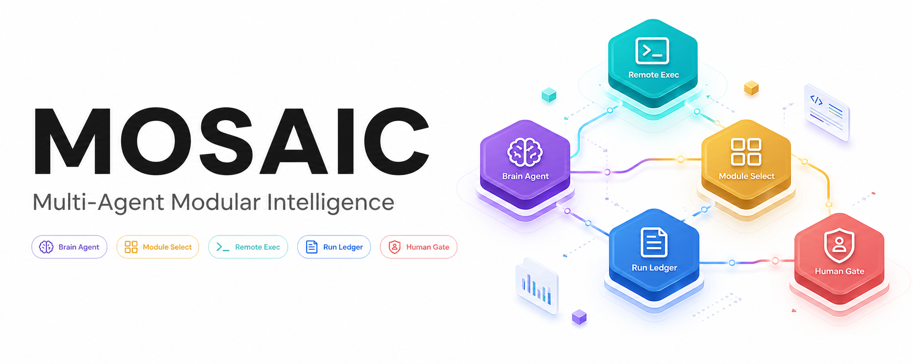

<a name="mosaic"></a>
<p align="center">
  
</p>

<p align="center">
  <h1 align="center">🧩 MOSAIC</h1>
  <p align="center">
    <strong>模块化多智能体数据科学竞赛框架</strong><br>
    <em>Modular Optimization and Search for Agentic Intelligence in Competitions</em>
  </p>
  <p align="center">
    <a href="#-项目介绍">项目介绍</a> •
    <a href="#-快速开始">快速开始</a> •
    <a href="#-实验结果">实验结果</a> •
    <a href="#-参数配置">参数配置</a> •
    <a href="#-论文引用">论文引用</a>
  </p>
</p>

<p align="center">
  <a href="https://m-a-p.ai/AutoKaggle.github.io/"></a>
  <a href="https://arxiv.org/abs/2410.20424"></a>
  
  
  
</p>

<p align="center">
  <a href="README.md">English</a> | <strong>中文</strong>
</p>

---

## 📖 项目介绍

MOSAIC 是一个用于自主数据科学竞赛的模块化多智能体框架。基于 AutoKaggle 构建，MOSAIC 在其基础上引入了更强大的竞赛工作流：

<table>
  <tr>
    <td width="50%">
      <h3>🧠 Brain-Coding 控制环</h3>
      <ul>
        <li>基于 Profile 的任务识别</li>
        <li>Brain-Coding 智能体控制循环</li>
        <li>结构化实验记忆</li>
        <li>排行榜反馈驱动的优化</li>
      </ul>
    </td>
    <td width="50%">
      <h3>🔒 鲁棒执行</h3>
      <ul>
        <li>远程执行隔离</li>
        <li>验证门控</li>
        <li>风险审计</li>
        <li>完整的过程报告</li>
      </ul>
    </td>
  </tr>
  <tr>
    <td width="50%">
      <h3>👥 多智能体协作</h3>
      <ul>
        <li>5 个专业智能体：Reader、Planner、Developer、Reviewer、Summarizer</li>
        <li>6 个核心竞赛阶段</li>
        <li>迭代开发 & 单元测试</li>
      </ul>
    </td>
    <td width="50%">
      <h3>🛠️ ML 工具库</h3>
      <ul>
        <li>经过验证的数据清洗函数</li>
        <li>特征工程工具集</li>
        <li>建模辅助函数</li>
      </ul>
    </td>
  </tr>
</table>

<p align="center">
  
</p>

<div align="right"><a href="#mosaic">↑ 返回顶部</a></div>

---

## 🚀 快速开始

**① 环境配置**

```bash
git clone https://github.com/GetIT-Sunday/MOSAIC-Modular-Optimization-and-Search-for-Agentic-Intelligence-in-Competitions.git
cd MOSAIC-...
conda create -n mosaic python=3.11
conda activate mosaic
pip install -r requirements.txt
```

**② 配置 API Key**

创建 `api_key.txt`：
```
sk-xxx                           # 你的 API Key
https://api.openai.com/v1       # Base URL
```

**③ 准备竞赛数据**

将 Kaggle 竞赛数据放入 `./multi_agents/competition/`：
```
competition/
├── train.csv
├── test.csv
├── sample_submission.csv
└── overview.txt    # 从 Kaggle 竞赛页面复制 Overview + Data 部分
```

**④ 运行 MOSAIC**

```bash
bash run_multi_agent.sh
```

<div align="right"><a href="#mosaic">↑ 返回顶部</a></div>

---

## ⚙️ 参数配置

<details>
<summary><strong>配置参数说明 — 点击展开</strong></summary>
<br>

| 参数 | 默认值 | 说明 |
|------|--------|------|
| `competitions` | — | 目标竞赛名称列表 |
| `start_run` | 1 | 实验起始轮次 |
| `end_run` | 5 | 实验结束轮次 |
| `dest_dir_param` | `"all_tools"` | 输出目录标识 |
| `model` | `gpt-4o` | Planner 和 Developer 使用的基础模型 |

其他智能体默认使用 `gpt-4o-mini`。如需更改，修改 `multi_agents/sop.py` 中的 `_create_agent`。

**输出结构：**
```
multi_agents/experiments_history/
└── <竞赛名>/
    └── <模型>/
        └── <dest_dir_param>/
            └── <运行轮次>/
```

</details>

<div align="right"><a href="#mosaic">↑ 返回顶部</a></div>

---

## 📊 实验结果

在 **8 个不同 Kaggle 竞赛**上的评估结果：

| 指标 | 得分 |
|------|------|
| 验证提交率 | **85%** |
| 综合评分 | **0.82** |

<p align="center">
  
  
</p>

<p align="center">
  
</p>

<div align="right"><a href="#mosaic">↑ 返回顶部</a></div>

---

## 📝 论文引用

```bibtex
@misc{li2024autokagglemultiagentframeworkautonomous,
  title={AutoKaggle: A Multi-Agent Framework for Autonomous Data Science Competitions},
  author={Ziming Li and Qianbo Zang and David Ma and Jiawei Guo and Tianyu Zheng and
          Minghao liu and Xinyao Niu and Yue Wang and Jian Yang and Jiaheng Liu and
          Wanjun Zhong and Wangchunshu Zhou and Wenhao Huang and Ge Zhang},
  year={2024},
  eprint={2410.20424},
  archivePrefix={arXiv},
  primaryClass={cs.AI},
  url={https://arxiv.org/abs/2410.20424},
}
```

<div align="right"><a href="#mosaic">↑ 返回顶部</a></div>

---

## 🤝 贡献

欢迎提交 Issue 和 Pull Request！

<div align="right"><a href="#mosaic">↑ 返回顶部</a></div>

---

## 📄 许可证

Apache 2.0 许可证 — 详见 [LICENSE.md](LICENSE.md)

> **免责声明**：本项目与 Kaggle 及 Google 没有任何官方关联。"Kaggle"一词仅用于表示与 Kaggle 竞赛的兼容性。

---

<p align="center">
  <strong>⭐ 如果 MOSAIC 对你的研究有帮助，请给个 Star！</strong>
</p>

<p align="center">
  <a href="https://star-history.com/#GetIT-Sunday/MOSAIC-Modular-Optimization-and-Search-for-Agentic-Intelligence-in-Competitions&Date">
    
  </a>
</p>

<p align="center">
  <sub>Made with ✨ by <a href="https://github.com/GetIT-Sunday">GetIT-Sunday</a> using <a href="https://github.com/GetIT-Sunday/ReadmeMagic-github-readme-design-skill">ReadmeMagic</a></sub>
</p>
